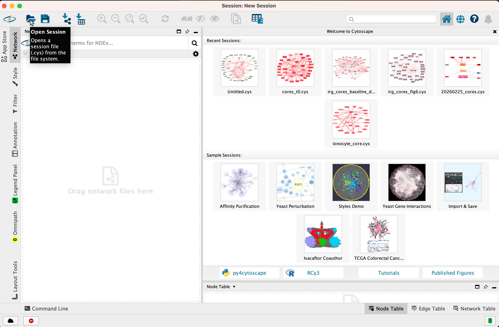

## Cytoscape Regulatory Network Visualization
To view the gene regulatory subnetworks, you must first install [Cytoscape](https://cytoscape.org). The subnetworks visualized in the manuscript were generated using `version 3.10.4`.
Once you have Cytoscape installed, download the `.cys` sesssion files in the [Cytoscape networks](GRN_Cytoscape_viz) folder and load to a new session as shown below.

---

## Session fie overview

Explore the GRNs generated in this study using our Cytoscape sessions:

* **[Steady-state core subGRNs](https://github.com/MiraldiLab/airwayGRN/blob/main/GRN_viz.md):** Steady-state (t=0h) cores for basal, suprabasal, ciliated, deuterosomal, ionocyte, and secretory cells. Basal-suprabasal and deuterosomal-ciliated shared networks are also included. Related to Figures 2 and 3.
* **[IRG cluster GRNs](https://github.com/MiraldiLab/airwayGRN/blob/main/GRN_viz.md):** Full and sub-GRNs for the enrichment of TFs in IRG clusters in basal, ciliated and secretory cells. Shared IIG core GRNs are also included. Related to Figure 6.
* **[Mucin and chemokine GRNs](https://github.com/MiraldiLab/airwayGRN/blob/main/GRN_viz.md):** Full and sub-GRNs describing mucin and chemokine regulation. Related to Figure 7.
