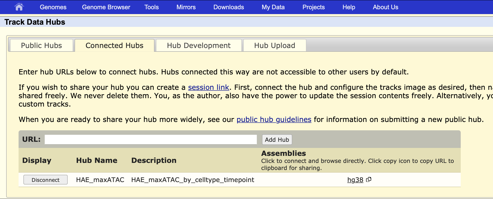
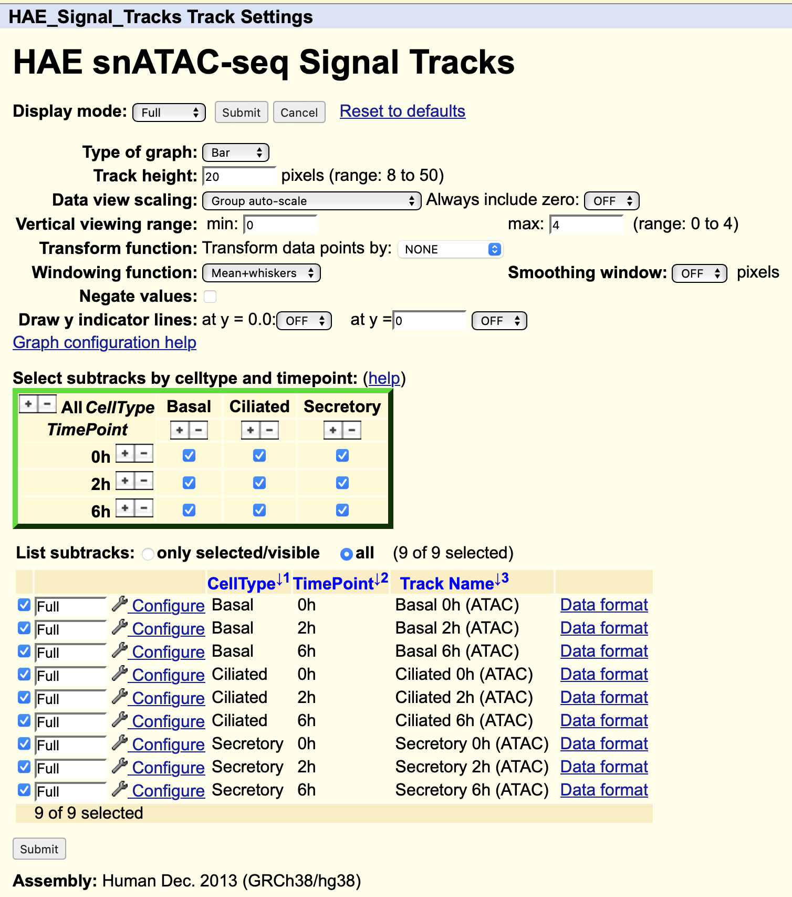

## UCSC Genome Browser Visualizations
We developed a track data hub to visualize both maxATAC-derived _in-silico_ and chromatin accessibility data for basal, ciliated and secretory cells, at steady-state and in reponse to IFN beta. see [Raney et al., 2014](https://academic.oup.com/bioinformatics/article/30/7/1003/232409) publication.

### Visualization of Genomic Regions
To load tthe track hub, navigate to [Track Data Hubs](https://genome.ucsc.edu/cgi-bin/hgHubConnect?#unlistedHubs), or to "My Data" > "Track Hubs" on the [UCSC Genome Browser website](https://genome.ucsc.edu/index.html). In the URL form, enter `https://gb.research.cchmc.org/hub/group/HAE/hub.txt` to add the track hub.

### Visualization of ATAC signal tracks
To modify viewing parameters for the chromatin accessibility tracks or to show specific subpopulations (e.g., the Th1 resting and active subpopulations), navigate to the HAE_Signal_Track settings page for this track and select the desired subopoulations to visualize, as shown below.

Once the changes are submitted, only the desired subpopulations appear in the browser, group auto-scaled according to the shown signal tracks.

### Visualization of ATAC signal tracks
By default, TFBS predictions are collapsed for each cell type and time point. You can visualize all TFs with predicted binding sites in that region for the chosen subpopulation by converting the view from "dense" to "full", as shown below.

